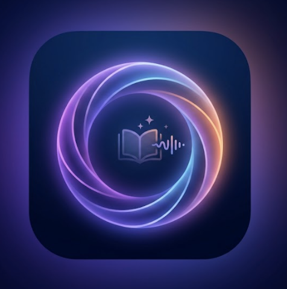

# ✨ Aura — AI English Pronunciation & Expression Coach

> **Live Demo:** [mamigo-dev.github.io/Aura](https://mamigo-dev.github.io/Aura/)

An AI-powered English learning app that goes **beyond what duolingo or ELSA do**: it analyzes your actual pronunciation quality (not just whether words are understood), identifies your specific accent issues, generates personalized training drills, and helps you sound more natural — especially if you're a technical professional who knows big words but struggles with everyday expressions.



---

## 🎯 What Makes Aura Different

| Typical English App | Aura |
|---|---|
| Gives you a score (e.g., "85/100") | Tells you **exactly which words** sounded off, what you said vs what you should have said, and **why** |
| Tests if Whisper/STT understood you | Uses **Azure phoneme-level analysis** to detect accent even when you're understood |
| One-size-fits-all exercises | Generates **personalized drills** based on your specific pronunciation issues |
| Only teaches beginner→advanced | **"Professional Mode"** for people who can read papers but freeze at happy hour |
| Score → nothing actionable | Score → **click → AI-generated drill** → practice → re-test |

---

## 🎓 Two Modes

### General Mode
For learners at any CEFR level (A1-C2). Features:
- **5 exercise types**: Read Aloud, Reading Comprehension, Recitation, Writing, Speech Mode
- **Daily streak** tracking and progress analytics
- **Category-based content**: News, Tech, Health, Business, etc.

### Professional Mode
For technical professionals with imbalanced English (strong technical, weak conversational):
- **Scene-based training**: The Shy Techie, The Academic, Scripted Presenter, etc.
- **Social Survival**: Multi-turn AI conversations in realistic workplace scenarios
- **Anxiety-tier categories**: Scenes You Freeze In, Things You Avoid, Sounds Too Robotic
- **Register Downshift**: Practice switching from formal to casual naturally

---

## 🚀 Getting Started

### Option 1: Install as an App (Recommended)

**iPhone:**
1. Open [mamigo-dev.github.io/Aura](https://mamigo-dev.github.io/Aura/) in **Safari** (not Chrome)
2. Tap the **Share** button (square with up-arrow)
3. Scroll down in the share sheet → **Add to Home Screen**
4. Tap **Add** — Aura appears on your home screen like a native app

**Android:**
1. Open the URL in Chrome
2. Menu → **Install app**

**Desktop:**
1. Open the URL in Chrome/Edge
2. Address bar → **Install icon** (computer with down-arrow)

### Option 2: Run Locally

```bash
git clone https://github.com/Mamigo-dev/Aura.git
cd Aura
npm install
npm run dev
```

Open http://localhost:5173/Aura/

---

## 🔑 API Keys Guide

Aura uses external AI APIs for the best experience. **None are required** — without keys, the app falls back to basic local scoring. But each key unlocks specific powerful features.

**Where to put keys:** Settings (⚙️) → API Keys. All keys are stored **locally in your browser** (IndexedDB). They never leave your device except to call the API provider directly.

### 🎯 Tier 1: Highly Recommended

#### **OpenAI** — The most important key
- **What it unlocks:**
  - 🎤 **Whisper** for accurate speech-to-text (much better than browser's built-in)
  - 🗣️ **TTS voices** — 6 natural AI voices (Alloy, Nova, Echo, Fable, Onyx, Shimmer) to hear model pronunciation
  - ✍️ **GPT-4o** for writing scoring, coaching feedback, and content generation
  - 💬 **Social Survival** conversation AI
- **Without it:** App uses browser's Web Speech API (less accurate, robotic voice)
- **Impact:** ⭐⭐⭐⭐⭐ — **10x quality improvement**
- **Get it:** [platform.openai.com/api-keys](https://platform.openai.com/api-keys)
- **Cost:** Pay-as-you-go, about **$0.01-0.05 per exercise**. Typical usage: $2-5/month

#### **Azure Speech** — The game changer for pronunciation
- **What it unlocks:**
  - 🔬 **Phoneme-level pronunciation analysis** — tells you exactly which sounds are off
  - Each word gets a real accuracy score (not a guess from text comparison)
  - Detects **accent issues even when you're correctly understood**
  - Powers the "Pronunciation Issues" section with specific tips
- **Without it:** AI guesses at pronunciation based on text only (unreliable)
- **Impact:** ⭐⭐⭐⭐⭐ — **Only way to get real pronunciation feedback**
- **Get it:**
  1. Go to [portal.azure.com](https://portal.azure.com)
  2. Create a **Speech** resource (free F0 tier available)
  3. Copy the **Key** and **Region**
- **Cost:** **FREE 5 hours/month** (~600 x 30-second practices). After: $1.32/hour

### 🤖 Tier 2: Alternative to OpenAI

#### **Anthropic (Claude)**
- **What it does:** Alternative to GPT for content analysis and coaching
- **Why you might want it:** Some people prefer Claude's writing style
- **Without OpenAI:** Claude can replace GPT for scoring, but **not** Whisper or TTS (those are OpenAI-only)
- **Impact:** ⭐⭐⭐ — Nice to have, but OpenAI is more versatile
- **Get it:** [console.anthropic.com](https://console.anthropic.com/)
- **Cost:** Similar to OpenAI, ~$0.01-0.05 per exercise

### 🔍 Tier 3: Fresh Content (Optional)

#### **Brave Search**
- **What it unlocks:**
  - 🗞️ **Stories page with real trending content** — fetches today's news/articles for any category
  - AI turns real search results into a custom reading passage with trending vocabulary highlighted
  - You see the original sources and can click through to read more
- **Without it:** Stories page shows hardcoded sample stories (still useful, but not fresh)
- **Impact:** ⭐⭐⭐ — Nice for daily fresh reading material
- **Get it:** [api.search.brave.com](https://api.search.brave.com/)
- **Cost:** **FREE 2000 queries/month** (plenty for personal use)

### 📊 What You Get At Each Level

| Setup | What Works |
|-------|-----------|
| **Nothing** | Basic exercises, local scoring (just word-matching), browser TTS, sample stories |
| **OpenAI only** | AI scoring, natural voices, writing feedback, social conversations, better speech recognition |
| **OpenAI + Azure** ⭐ | **Recommended** — Everything above + real phoneme-level pronunciation feedback |
| **+ Brave** | Fresh daily trending content in Stories, AI-generated reading passages from real news |

### 💡 Starter Recommendation

Most users only need **2 keys**:
1. **OpenAI** — covers 80% of AI features
2. **Azure Speech** — covers the remaining 20% (the critical pronunciation accuracy)

Combined cost: **~$0-5/month** for typical personal use (Azure free tier + OpenAI pay-as-you-go).

Add **Brave** if you want fresh daily content (free 2000/month).

---

## 🎮 How to Use

### First Time Setup (2 minutes)
1. Open the app
2. **Welcome slides** → Next → Next → Get Started
3. **Choose your mode**: General Learner or Professional
4. **Pick your level** (self-assess, no tedious test)
5. **Select interests/scenes** (at least 2)
6. Done! Go to Settings → API Keys to add keys

### Daily Practice
1. **Home page** shows your daily exercises
2. Tap an exercise (Read Aloud is the most feature-rich)
3. Tap **🎤 Tap to speak** to record
4. Tap again to stop
5. Tap **Submit for Scoring**
6. Review detailed AI feedback:
   - **Pronunciation Issues** — specific words that need work
   - **Listen (AI)** — hear the correct pronunciation
   - **My Voice** — hear your own pronunciation of that word
   - **Intonation Issues** — where your tone was wrong
   - **Training Plan** — personalized drills to improve

### Training Drills
After a Read Aloud exercise, tap **Start Training Now** or go to **Training** from Home:
- Each training exercise generates an AI-custom drill:
  - **Minimal Pairs** (e.g., "thin vs sin" for /θ/)
  - **Tongue Twisters** for specific sounds
  - **Targeted Passages** loaded with your problem sounds
- Listen to the model → Record yourself → Next word → Complete

---

## 🔒 Privacy & Security

- **All data stays on your device** — IndexedDB in your browser
- **API keys never leave your browser** except to call the respective API directly (OpenAI, Azure, etc.)
- **No analytics, no tracking, no backend server**
- **No account required** — just install and use
- App is **open source** — you can read the code or self-host

---

## 🛠️ Tech Stack

- **Frontend:** React 19 + TypeScript + Vite + Tailwind CSS
- **PWA:** vite-plugin-pwa + Workbox (offline support)
- **Storage:** IndexedDB via `idb`
- **Speech:** Web Speech API (recording) + MediaRecorder (audio capture)
- **AI Integration:** Direct browser→API calls (BYOK model)
- **Deployment:** GitHub Pages + GitHub Actions (auto-deploy on push)

---

## 📝 License

MIT — Free to use, modify, and share.

---

## 🙏 Feedback / Contributing

Open an issue or PR on [GitHub](https://github.com/Mamigo-dev/Aura). This was built as a personal project, but improvements are welcome.

---

**Built with AI. Designed for humans who want to sound more human in English.** ✨
